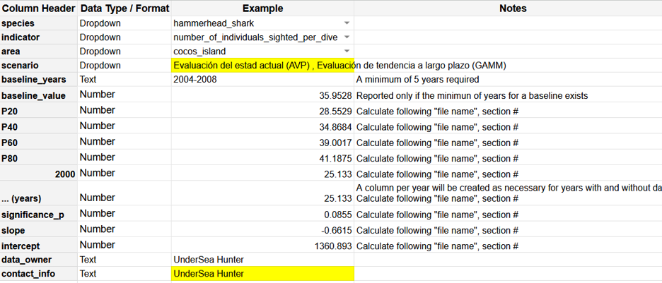

## a. Formato si entrega los datos crudos

Todo archivo de datos debe entregarse en formato .csv separado por punto y coma de preferencia, o en formato Excel alternativamente, y debe cumplir con estos requisitos (Se anexo una plantilla de Excel datos crudos):

**Contenido del archivo de datos:**

1.    **Conjunto de datos de monitoreo** depurados, actualizados y ordenados con las siguientes columnas.



2.    **Metadatos del propietario, institución y proyecto** generador de los datos en las siguientes columnas:

```         
a.    Nombre propietario datos o investigador principal

b.    Nombre institución propietaria de datos

c.     ORCID del propietario de datos o investigador principal

d.    Permiso de investigación

e.    Donante

f.      Restricción o estado de uso de datos (embargo, publicados, etc)

g.    Si están publicados, brindar el DOI
```

3.    **Documentación asociada** (protocolos de campo asociados, entre otros).

4.    **Carpeta de logos** de dueños o a quien se debe dar créditos de ellos, debe ser la misma afiliación con la que se firmó el MoU.

5.    **Archivo espacial (.shp)** de su sitio de muestreo, nombrado con el mismo nombre con el que se reporta en la columna “area” de los datos

Figura (o tabla). Ejemplo de Excel o csv conjunto de datos y metadatos
